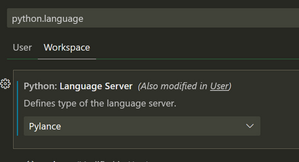

# VSCode and Pylance

VSCode  uses Pylance, and optionally a linter such as pylint or mypy.

## Install the stubs from PyPi :

`pip install -U micropython-<port>-stubs` 
For details see [Using stubs](20_using.md)

## Configure VSCode & Pylance

VSCode allows the configuration to be set on **_workspace_** , folder or _user_ level. I prefer setting it per workspace or folder as that allows different settings for different projects, but you could do either.
### install the Python extensions
1.  Install the [Python extension](https://marketplace.visualstudio.com/items?itemName=ms-python.python) from the marketplace. [Pylance](https://marketplace.visualstudio.com/items?itemName=ms-python.vscode-pylance) will be installed as an optional extension.
2.  Open a Python (.py) file and the Pylance extension will activate.

### Select the correct python environment

If you have created a `venv` make sure to also select it in VSCode using 
`F1, >Python: select interpreter` or the UX 


### Set Pylance as the language Server  
Note: If you've previously set a language server and want to try Pylance, make sure you've set `"python.languageServer": "Default" or "Pylance"` in your settings.json file using the text editor, or using the Settings Editor UI.



Example from `.vscode/settings.json`
```json
    "python.languageServer": "Pylance",
    "python.linting.enabled": true,
    "python.linting.pylintEnabled": true,
```


## Add configuration to suppress false positives and unneeded warnings


[Pylance]: https://marketplace.visualstudio.com/items?itemName=ms-python.vscode-pylance

