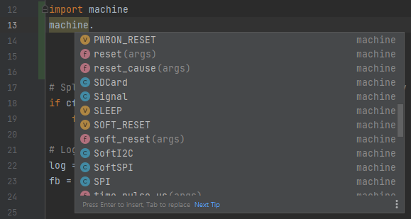

# PyCharm

## Configure PyCharm to use the selected stub folders  

ref: https://www.jetbrains.com/help/pycharm/type-hinting-in-product.html#stub-type-hints

PyCharm supports Python stub files, you can specify the type hints using Python 3 syntax for both Python 2 and 3.
Any type hints availble in installed (stub only) packages  become available to PyCharm to help it understand your code.

### Option 1) Install the stubs from PyPi :

you need to know which port you want the stubs for `stm32`, `esp32`, `rp2`, `esp8622`

### `pip install -U micropython-<port>-stubs` 

or install the stubs for a specific version of micropython unsing  
`pip install -U micropython-stm32-stubs==1.17.*`

### Option 2) Clone the stubs repo 
Older method of installation ( not needed if you used the pip install method) 
To use stubs from the micropython-stubs repository , follow these steps:

Copy some or all the stubs into a directory in your project, or use a symlink to a clone of the stubs.

- Mark the relevant directories as a source root by choosing **Mark Directory as | Sources Root** from the context menu of the directory.  
For example: 

  - all-stubs/cpython_core-pycopy
  - all-stubs/micropython-v1_17-frozen/esp32/GENERIC
  - all-stubs/micropython-v1_17-esp32

You should now be able to use code completion and typechecking for your micropython code in PyCharm

## Check library imports

To check if the correct types are used for tyoou imports you can 'hover' the mouse over the module of an import statement. 
Pycharm will show the module's docstring that will allow you to identify which stub is being used.

## Verify the paths 
You can verify the paths used in your project by 

File > Settings > Project Settings 
> Project Structure 

This should list the selected folders with stubs as Source Folders 

